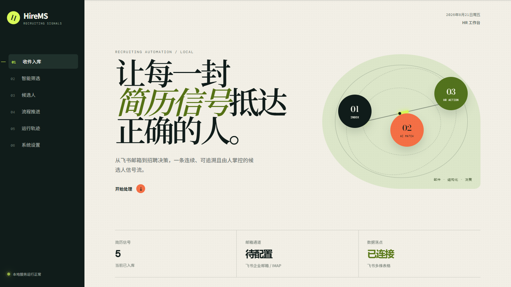
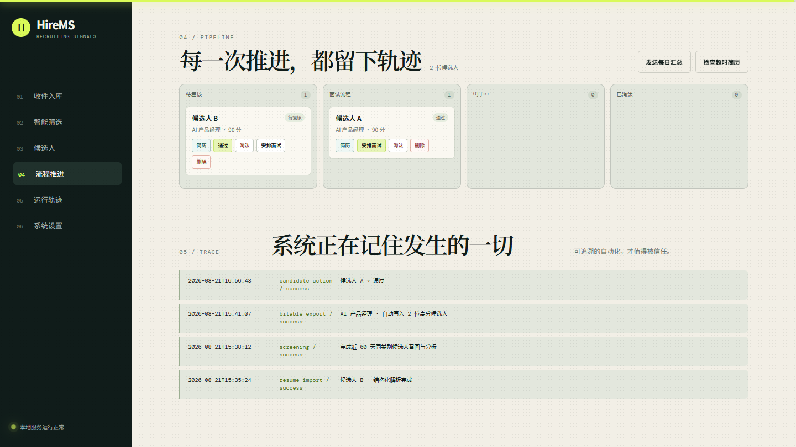
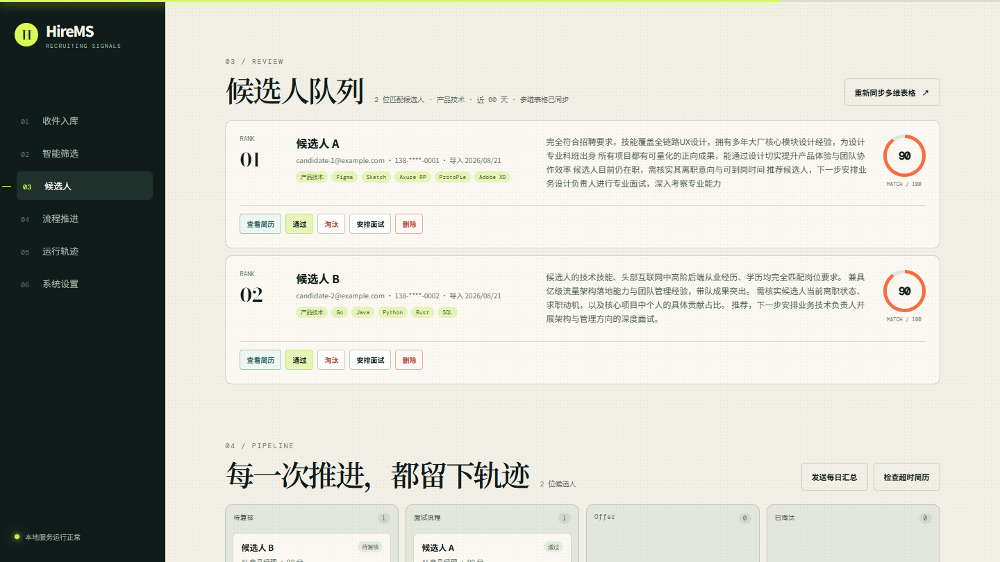
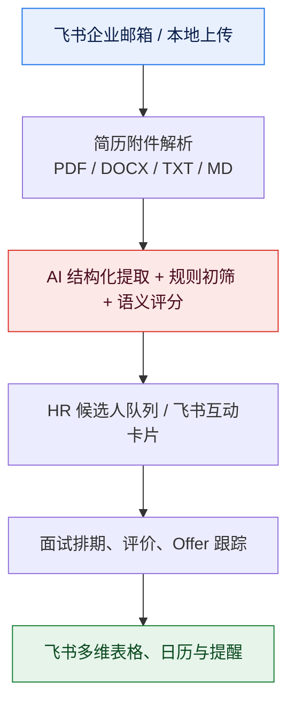
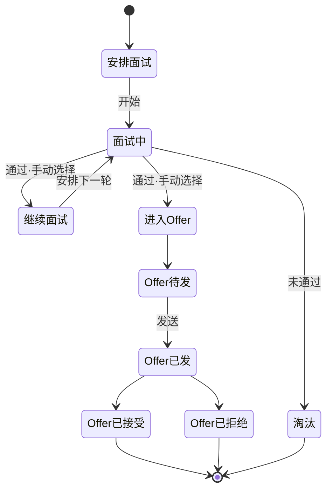

<div align="center">

# HireMS · 飞书招聘自动化系统

### 从简历邮件到 Offer 的一站式本地招聘工作台

[](https://www.python.org/)
[](https://fastapi.tiangolo.com/)
[](https://www.langchain.com/)
[](https://www.trychroma.com/)
[](https://apscheduler.readthedocs.io/)
[](https://open.feishu.cn/)
[](https://github.com/)

**AI 结构化提取 · 规则初筛 · 语义评分 · 飞书闭环** —— 让 HR 把时间花在人，而不是表格上。

</div>

---

## 目录

- [✨ 核心能力](#-核心能力)
- [🖼️ 界面预览](#️-界面预览)
- [🏗️ 工作流程](#️-工作流程)
- [🧰 技术栈](#-技术栈)
- [🚀 快速开始](#-快速开始)
- [大规模候选人筛选](#大规模候选人筛选)
- [HR 使用流程](#hr-使用流程)
- [飞书配置](#飞书配置)
- [面试与 Offer 状态机](#面试与-offer-状态机)
- [自动提醒](#自动提醒)
- [📡 核心接口](#-核心接口)
- [数据与安全](#数据与安全)
- [✅ 验证](#-验证)
- [📄 相关飞书文档](#-相关飞书文档)

---

## ✨ 核心能力

- **邮件到简历自动入库**：从飞书企业邮箱（IMAP）抓取简历附件，按邮件与附件指纹自动去重。
- **多格式简历解析**：支持 PDF / DOCX / TXT / MD，结构化提取候选人信息。
- **AI + 规则双引擎筛选**：按岗位要求执行 AI/规则筛选与评分，给出可解释的匹配度。
- **飞书多维表格双向同步**：候选人自动写入多维表格，面试与 Offer 状态自动回写。
- **互动消息卡片**：HR 可直接在飞书卡片点击「通过 / 淘汰 / 安排面试」。
- **灵活面试流转**：面试轮次自定义命名，不强制固定流程；支持评价、改期、取消。
- **飞书日历排期**：排期前检查 HireMS 冲突，并可查询已授权面试官日历忙闲。
- **全链路自动提醒**：每日 09:00 处理汇总、48 小时未处理提醒、面试前 1 小时提醒。

> 💡 **没有配置飞书？** 以上流程仍可在本地 SQLite 工作流中完整运行；配置完成后自动接入飞书。

---

## 🖼️ 界面预览

| 收件与入库 | 简历列表 | 筛选结果 |
| :---: | :---: | :---: |
|  |  |  |

---

## 🏗️ 工作流程



---

## 🧰 技术栈

| 层 | 选型 |
| --- | --- |
| Web 框架 | FastAPI · Uvicorn |
| AI / LLM | LangChain · LangChain-OpenAI · OpenAI 兼容接口 |
| 向量检索 | ChromaDB（默认） · PyMilvus（可选） · DiskCache 缓存 |
| 文档解析 | pypdf · python-docx |
| 调度 | APScheduler |
| 生态集成 | 飞书多维表格 · 飞书消息卡片 · 飞书日历 · IMAP/SMTP |
| 打包 | PyInstaller（可生成 Windows 可执行文件） |

---

## 🚀 快速开始

环境要求：**Python 3.10+**，以及一个 OpenAI 兼容的 LLM / Embedding 服务。

```powershell
cd HireMS
python -m venv .venv
.venv\Scripts\activate
pip install -r requirements.txt
Copy-Item .env.example .env
```

编辑 `.env`，至少配置 LLM 与 Embedding：

```env
HIREMS_LLM_API_KEY=你的密钥
HIREMS_LLM_BASE_URL=https://你的兼容接口/v1
HIREMS_LLM_MODEL=你的模型名

EMBEDDING_API_KEY=你的密钥
EMBEDDING_BASE_URL=https://你的兼容接口/v1
EMBEDDING_MODEL=你的嵌入模型名
VECTOR_DB=chroma

# 可选：原始简历本地保存目录
RESUME_FILE_DIR=./data/resumes
```

启动本地 Web UI：

```powershell
python -m uvicorn app.main:app --reload --port 8000
```

打开 <http://127.0.0.1:8000/>，接口文档位于 <http://127.0.0.1:8000/docs>。

<details>
<summary><b>📦 大规模候选人筛选（点击展开）</b></summary>

筛选会先从全部已入库简历的向量索引中召回最相关的候选池，再执行经验、学历、技能、地点等硬过滤与评分；只有评分靠前的候选人才会调用 LLM 生成评价。默认配置为「召回 50 份、分析前 10 份」，因此不会对所有简历逐份调用 LLM。

```env
SCREENING_RETRIEVAL_LIMIT=50
SCREENING_LOOKBACK_DAYS=60
SCREENING_ANALYSIS_LIMIT=10
CANDIDATE_ANALYSIS_MAX_TOKENS=360
CANDIDATE_ANALYSIS_MAX_CHARS=260
```

导入时由 LLM 提取岗位类别，再归一化为教育培训行业的九个宽类别：`销售`、`教师`、`教务学管`、`运营`、`市场`、`管理`、`产品技术`、`职能`、`其他`，同时记录 UTC 时间戳。JD 会解析为相同类别，向量库只在最近 `SCREENING_LOOKBACK_DAYS` 天且类别一致的简历中召回；默认 60 天。课程顾问、招生顾问、电销等归为销售，学科老师、讲师、教研/授课等归为教师，避免类别拆得过细。

升级前已经入库的简历会在首次筛选时从现有向量文本一次性补齐类别和原始入库时间，不会再次调用 LLM；向量记录缺失的个别历史简历才需要重新导入。

候选池较大时可将 `SCREENING_RETRIEVAL_LIMIT` 调至 100～200；若响应时间或成本更重要，则优先下调 `SCREENING_ANALYSIS_LIMIT`。每份 AI 评价会被限制为四条简短要点，并在本地兜底截断，避免队列卡片显示半截报告。

</details>

---

## HR 使用流程

1. 在「收件与入库」中同步邮箱或手动导入简历。
2. 输入岗位要求，例如「3 年以上 Python 后端、熟悉 FastAPI、本科及以上、北京」。
3. 运行筛选，查看 AI 评分和候选人摘要。
4. 在候选人卡片或「招聘流程」看板中查看原始简历，并执行通过、淘汰、安排面试。
5. 完成面试评价后，由 HR 手动选择继续面试或进入 Offer；跟踪待发、已发、已接受或已拒绝。

---

## 飞书配置

> ⚠️ 所有敏感信息仅放在 `.env`，**不要提交到 Git 或输入 Web UI**。

### 1. 邮箱抓取

```env
MAIL_IMAP_HOST=imap.feishu.cn
MAIL_IMAP_PORT=993
MAIL_IMAP_USER=hr@example.com
MAIL_IMAP_PASSWORD=邮箱专用应用密码
MAIL_IMAP_FOLDER=INBOX
MAIL_SUBJECT_KEYWORDS=简历,应聘,求职
MAIL_LOOKBACK_DAYS=7

# 候选人面试邮件；账号和密码留空时复用上面的 IMAP 配置
MAIL_SMTP_HOST=smtp.feishu.cn
MAIL_SMTP_PORT=465
MAIL_SMTP_USER=hr@example.com
MAIL_SMTP_PASSWORD=邮箱专用应用密码
MAIL_SMTP_USE_SSL=true
MAIL_SMTP_FROM_NAME=招聘团队
CANDIDATE_EMAIL_NOTIFICATIONS=true
```

需要由管理员先开通 IMAP/第三方客户端访问。若企业邮箱不支持 IMAP，可保留手动导入，或实现企业已批准的邮件 API 适配器。

### 2. 多维表格

```env
FEISHU_APP_ID=cli_xxx
FEISHU_APP_SECRET=xxx
FEISHU_BITABLE_APP_TOKEN=app_xxx
FEISHU_BITABLE_TABLE_ID=tbl_xxx
FEISHU_BITABLE_AUTO_EXPORT=true
FEISHU_EXPORT_MIN_SCORE=0.70
```

筛选完成后，系统会自动把达到 `FEISHU_EXPORT_MIN_SCORE` 的候选人写入多维表格，并以「筛选批次 + 候选人」记录本地同步状态，重复读取结果或点击「重新同步多维表格」不会重复新增记录。自动写入直接复用本次筛选和 AI 报告，**不会再次调用 LLM**。新候选人消息卡片不再由 HireMS 直接发送，可在飞书多维表格中根据新增记录配置自动化。

为了让面试和 Offer 状态自动回写，请在同一多维表格增加以下字段：`当前面试轮次`、`面试状态`、`面试评价`、`面试时间`、`Offer状态`。建议均使用文本字段；原有 `处理状态` 字段继续保留。历史记录没有保存飞书 `record_id`，需要重新运行一次岗位筛选生成新记录后才能被后续状态回写定位。

> 目标表建议包含：`姓名`、`邮箱`、`电话`、`岗位`、`匹配度`、`技能`、`期望地点`、`AI分析`、`处理状态`。应用必须拥有该多维表格的编辑权限。

### 3. 飞书消息卡片与回调

```env
FEISHU_HR_RECEIVER_IDS=ou_xxx,ou_yyy
FEISHU_CALLBACK_TOKEN=你的回调Token
FEISHU_PUBLIC_BASE_URL=https://hirems.example.com
```

启动 Web UI 后也可以点击左侧底部的「系统设置」，管理 HR OpenID、HR 联系邮箱、默认面试官、默认面试地点、邮件发件人名称和超时提醒时间。这些业务设置保存在本地 SQLite 并立即生效；`FEISHU_APP_SECRET`、邮箱密码等凭据仍只允许通过 `.env` 配置，不会显示在网页中。

在飞书开放平台为自建应用启用机器人能力，并订阅 `card.action.trigger`。回调地址：

```text
https://你的公网域名/api/v1/feishu/card-actions
```

> 本机 `localhost` 不可被飞书访问；测试交互卡片需使用飞书长连接或公司批准的公网网关。

### 4. 面试日历与忙闲检查

```env
FEISHU_CALENDAR_ID=feishu.cn_xxx@group.calendar.feishu.cn
FEISHU_INTERVIEWER_CALENDAR_MAP={"ou_xxx":"feishu.cn_xxx@group.calendar.feishu.cn"}
```

`FEISHU_CALENDAR_ID` 是招聘共享日历，应用须有 writer/owner 权限。面试官个人日历不能在未授权时读取；通过 `FEISHU_INTERVIEWER_CALENDAR_MAP` 明确配置可读日历后，系统会在排期前查询对应的忙闲状态。

> 外部候选人通常没有企业飞书 Open ID，因此目前飞书提醒发送给 HR/面试官；候选人通知建议对接企业邮件或短信服务。

---

## 面试与 Offer 状态机

面试不再强制按 `一面 → 二面 → 终面` 推进。轮次名称可以直接填写（例如业务面、试讲、加试或 HR 面）；每次面试结论为「通过」时，HR 必须手动选择下一环节是「继续面试」还是「进入 Offer」。



选择继续面试后可自行安排并命名下一轮，选择进入 Offer 后状态变为 `Offer待发`，之后依次为 `Offer已发 → Offer已接受 / Offer已拒绝`。Web UI 支持面试评价、改期和取消。飞书日历只创建或更新招聘共享日历中的会议日程，不添加参与人；候选人在安排、改期、取消和面试前约一小时收到邮件。

---

## 自动提醒

服务运行期间，APScheduler 会执行：

| 任务 | 频率 | 行为 |
| --- | --- | --- |
| 📊 昨日处理汇总 | 每天 09:00 | 推送处理数量、状态分布和待复核数量 |
| ⏰ 超时提醒 | 每 30 分钟 | 提醒超过 `NOTIFY_OVERDUE_HOURS` 未复核的候选人 |
| 🗓️ 面试提醒 | 每 5 分钟检查 | 对一小时内开始的面试提醒面试官 |

> 提醒未配置飞书时会保留在本地运行记录，不会丢失流程状态。

---

## 📡 核心接口

所有接口前缀为 `/api/v1`。

| 方法 | 路径 | 用途 |
| :--- | :--- | :--- |
| `POST` | `/resumes` | 手动上传简历 |
| `GET` | `/resumes/{id}/file` | 预览原始简历；追加 `?download=true` 可下载 |
| `POST` | `/operations/mail-sync` | 同步邮箱附件 |
| `POST` | `/queries` | 提交岗位要求 |
| `GET` | `/results/{query_id}` | 执行筛选并返回结果 |
| `GET` | `/workflow/candidates` | 获取招聘流程队列 |
| `POST` | `/workflow/candidates/{id}/action` | 通过、淘汰或安排面试 |
| `POST` | `/workflow/interviews` | 创建面试排期 |
| `PATCH` | `/workflow/interviews/{id}` | 修改面试时间、地点和面试官 |
| `POST` | `/workflow/interviews/{id}/cancel` | 取消面试并同步删除飞书日程 |
| `POST` | `/workflow/interviews/{id}/feedback` | 回填面试评价 |
| `POST` | `/workflow/candidates/{id}/offer` | 更新 Offer 状态 |
| `POST` | `/workflow/notifications/{kind}` | 手动触发 `daily_summary`、`overdue` 或 `interview_reminder` |
| `POST` | `/feishu/card-actions` | 接收飞书卡片回传 |

---

## 数据与安全

- `.env`、邮箱密码和飞书 App Secret **不会**在页面中保存或回显。
- 本地 `data/hirems_ops.sqlite3` 保存邮件附件指纹、候选人工作流、面试、通知日志和原件相对路径；原始简历默认保存在 `data/resumes/`，不保存邮箱密码。
- 删除候选人时会同步删除其本地原始简历。历史候选人若没有原件，需要重新导入一次后才能在队列中打开。
- AI 评分只用于辅助决策。淘汰、约面与 Offer 应保留人工审核。
- 上线前应设置候选人数据留存周期、访问权限、审计策略和离职人员权限回收流程。

---

## ✅ 验证

```powershell
python -m pytest tests/test_api.py tests/test_document_parsing.py -q
```

查看原始简历功能的专项测试位于 `tests/test_resume_file_access.py`。

---

## 📄 相关飞书文档

- [批量新增多维表格记录](https://open.feishu.cn/document/server-docs/docs/bitable-v1/app-table-record/batch_create?lang=zh-CN)
- [发送消息卡片](https://open.feishu.cn/document/uAjLw4CM/ukTMukTMukTM/reference/im-v1/message/create)
- [卡片回传交互](https://open.feishu.cn/document/feishu-cards/card-callback-communication?lang=zh-CN)
- [创建日程](https://open.feishu.cn/document/server-docs/calendar-v4/calendar-event/create?lang=zh-CN)

---

<div align="center">

**如果 HireMS 帮到了你，欢迎点个 ⭐ Star 让更多人看到**

</div>
